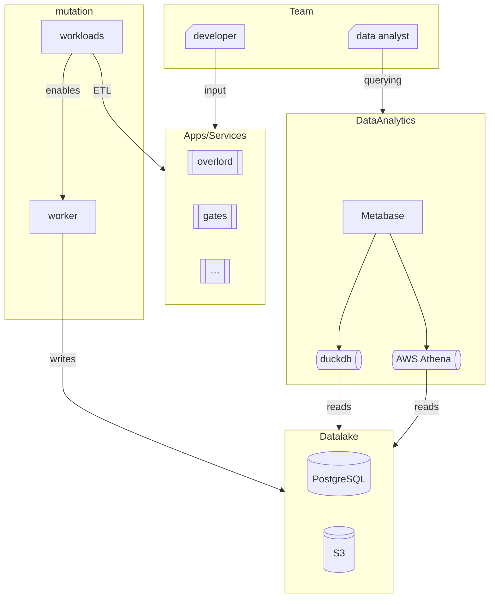

# Plaza SanMiguel Space on Github

Main projects:

🚀 Overlord: Whole PlazaSanMiguel workflows manager.

💽 Plaza-Lake: Data analytics containers.

📈 Metabase: Data exploring dashboards

🛜 sFTP Endpoints: PUCP and Camera flows.

**Infrastructure**:

⚙️ Zero downtime for high user availability.

⚙️ AI workflow integrations.

⚙️ Auto-scaling on demand.

⚙️ ETL data analytics storage automation.

---

